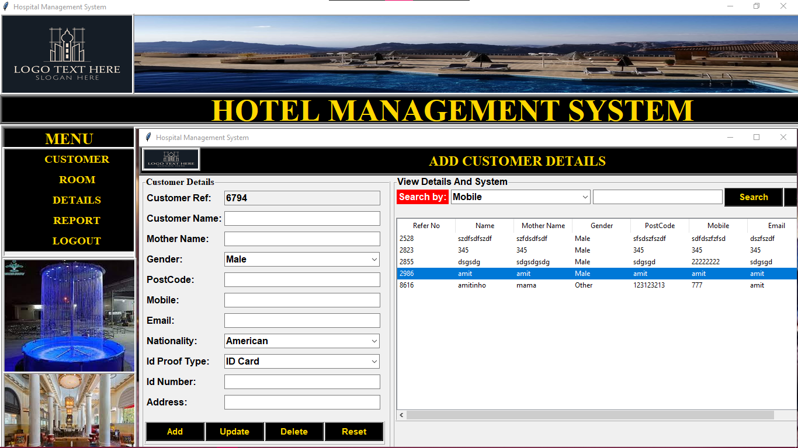
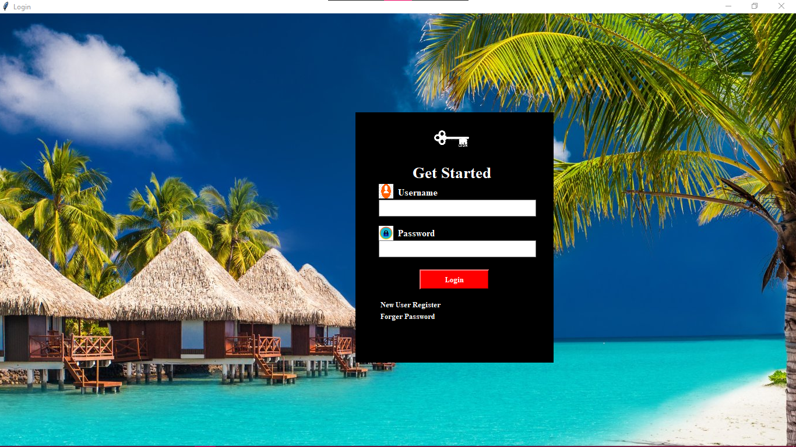
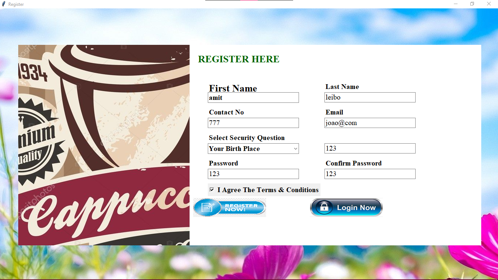

# Hotel-program-Gui-Tkinter-python-sql
Easy to use Hotel management program. Including log in authentication,Submitting customer details.
Using python and mySQL.

this project is made with Tkinter which is the standard GUI library for Python. 

In order to use this you need to download mySQL, then set it up with a new schema called "management", within that make new tables with names: customer, register, room and details.

P.S. If you're interested in contributing go ahead and create a pull request :-)
Please share and like =]

